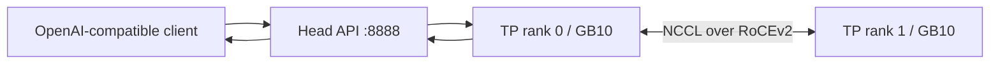

# 两台 DGX Spark 跑一个大模型：双机推理部署实战

一套经过真实双机验证、可检查、可复现的 NVIDIA DGX Spark 推理部署模板。

这个仓库记录我在两台 ARM64 DGX Spark 上，把模型缓存、容器镜像、RoCEv2、NCCL、
vLLM 原生多节点执行器、NVFP4、FP8 KV cache 和 Qwen MTP 串成一个可用服务的过程。
重点不是“一条神奇命令”，而是把每个容易踩坑的动态条件都做成启动前检查。

> [!IMPORTANT]
> 仓库不包含模型权重、Hugging Face 凭据、容器镜像或生成内容。模型与镜像许可证
> 需要由使用者单独确认。

## 已验证配置

以下结果来自 2026-08-19 的一次双机验收，不是厂商基准，也不代表其他镜像版本必然相同。

| 项目 | 实测配置 |
|---|---|
| 硬件 | 2× DGX Spark，每节点 1× GB10、约 121.69 GiB 可见统一内存 |
| 架构 | Linux ARM64，CUDA Compute Capability 12.1（SM121） |
| 节点互联 | 单条 200 Gb/s RoCEv2 fabric，NCCL `NET/IB` |
| 运行时 | vLLM `0.27.2rc1.dev110+gacb0f1dcd`，CUDA 13 |
| 镜像 | `vllm/vllm-openai:nightly`，通过完整 image ID 锁定 |
| 模型 | `unsloth/Qwen3.8-27B-NVFP4` |
| 并行 | TP=2、PP=1，vLLM 原生多节点 `mp`，不依赖 Ray |
| 量化 | `compressed-tensors` 自动识别；NVFP4 GEMM 使用 FlashInfer CUTLASS |
| KV cache | FP8 E4M3 |
| MTP | Qwen3.5 原生 MTP，1 个 draft token |
| API | 默认仅监听 Head 的 `127.0.0.1:8888` |

## 一次请求如何跨越两台机器



这不是两个独立副本：同一个模型实例被切成两个 Tensor Parallel rank，每一步推理都需要
两台机器参与。管理流量可以走普通 LAN/SSH，collective 通信则显式绑定专用 RoCE 网卡。

## 为什么做成这个仓库

实际部署里，最费时间的通常不是模型下载，而是以下细节：

- 同一个镜像 tag 在两台机器上不一定指向同一个 image ID。
- Hugging Face 路径相同不代表 revision 和 blob 一致。
- RoCEv2 GID index 会变化，不能把某次探测结果永久写死。
- 网卡名和 HCA 名区分大小写，NCCL 自动选网经常选到管理网络。
- GB10 是统一内存，`docker stats` 和传统独显的 `nvidia-smi memory.total` 都不能单独解释容量。
- 模型声明 `compressed-tensors` 时强制传 `--quantization modelopt` 会在启动阶段失败。
- JSON 参数经 SSH 远程 shell 容易丢引号；MTP 使用独立 CLI 参数更稳妥。
- “缓存里有 MTP 权重”不等于已启用 MTP，必须看到 resolved speculative config 和接受率指标。

这些检查都已经进入脚本，而不是只留在文档里。

## 快速开始

前提：两节点均已安装 Docker/NVIDIA runtime，SSH 免密可用，模型缓存和镜像已准备好，
RoCE 链路处于 `ACTIVE / LINK_UP`。

```bash
git clone <your-repository-url>
cd dgx-spark-dual-node-inference
cp .env.example .env
# 编辑 .env：SSH 用户、模型路径、接口/HCA、镜像 ID 等。

make audit
make preflight
make up
make wait
make smoke
```

如果模型只在 Head 上：

```bash
make sync-model
make verify-model
```

查看状态、内存和 MTP 指标：

```bash
make status
make memory
make mtp-metrics
```

停止且只删除本仓库创建的两个服务容器：

```bash
make down
```

## 安全默认值

API 默认只绑定 `127.0.0.1:8888`，没有 API key 时不会允许配置为非 loopback 地址。
远程客户端可以使用 SSH tunnel：

```bash
ssh -L 8888:127.0.0.1:8888 user@spark-head
```

如果确实需要监听局域网地址，必须同时设置：

```dotenv
API_BIND=10.0.0.10
ALLOW_REMOTE_API=true
API_KEY=至少二十四个字符的随机密钥
```

完整边界见 [docs/SECURITY.md](docs/SECURITY.md)。

## 实测内存与 MTP 取舍

启用 MTP 后，每节点主模型加 draft head 约占 11.07 GiB；vLLM 在 75% 内存预算下为
FP8 KV cache 分配约 73.8–74.0 GiB。两节点合起来并不是一个共享内存池，每个 TP rank
各自保存自己的权重和 cache 分片。

| 指标 | 未启用 MTP | 启用 1-token MTP |
|---|---:|---:|
| 每节点模型内存 | 约 10.67 GiB | 约 11.07 GiB |
| Head KV cache | 约 74.64 GiB | 约 73.97 GiB |
| Worker KV cache | 约 74.27 GiB | 约 73.81 GiB |
| 全局 KV token 容量 | 约 4,676,407 | 约 4,305,153 |
| 262,144-token 理论 KV 并发 | 约 17.84× | 约 16.42× |

一次 96-token 输出验收后，MTP 累计接受 41/54 个 draft tokens，约 75.9%。这是功能
验收样本，不是吞吐基准。更多解释见 [docs/QWEN38-NVFP4-MTP.md](docs/QWEN38-NVFP4-MTP.md)
和 [docs/MEMORY.md](docs/MEMORY.md)。

## 仓库结构

| 路径 | 用途 |
|---|---|
| `.env.example` | 已验证 Qwen3.8 案例的可编辑配置 |
| `scripts/preflight.sh` | 镜像、模型、架构、RoCE/GID、设备与端口检查 |
| `scripts/sync-model-cache.sh` | 可续传地同步 Hugging Face 模型缓存 |
| `scripts/verify-model-sync.sh` | 两节点逐文件 checksum 验证 |
| `scripts/up.sh` | 启动 Worker rank 1 和 Head rank 0/API |
| `scripts/wait-ready.sh` | 等待冷启动并在失败时收集两侧日志 |
| `scripts/smoke-chat.sh` | OpenAI Chat Completions 验收请求 |
| `scripts/memory-report.sh` | 统一内存、权重、KV cache 与 CUDA Graph 报告 |
| `scripts/mtp-metrics.sh` | MTP drafted/accepted token 指标 |
| `scripts/public-audit.sh` | 发布前语法、密钥、主机身份和大文件检查 |
| `docs/` | 架构、网络、内存、安全、复现与排障记录 |

## 范围与限制

- 模板固定为两节点、每节点一张 GPU、TP=2；不是任意规模编排器。
- 已验证案例使用 vLLM；SGLang、TensorRT-LLM 和原生 PyTorch 的多节点参数不同。
- MTP speculative decoding 下，当前 vLLM 不支持 `min_p` 和 `logit_bias`。
- 脚本默认两节点模型缓存使用相同绝对路径，但仍会分别校验 revision 与断链。
- 更换模型、镜像 digest、量化格式、上下文长度或网络 fabric 后，应重新执行完整验收。
- 这里记录的是一套实验室部署经验，不是生产 SLA、安全审计或上游支持承诺。

## License

仓库中的脚本与文档采用 MIT License。模型、权重、容器镜像及其输出遵循各自许可证。
